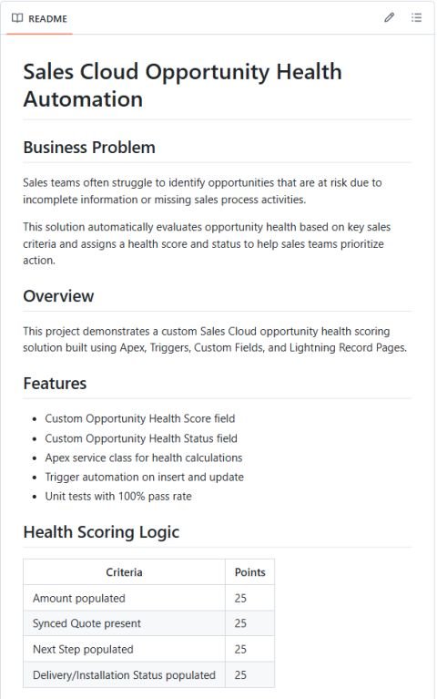
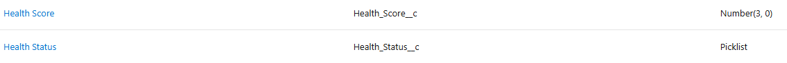
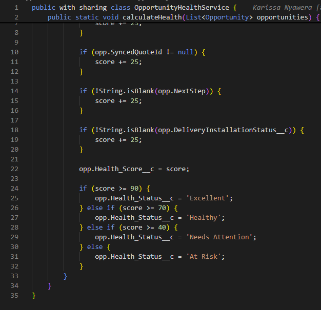
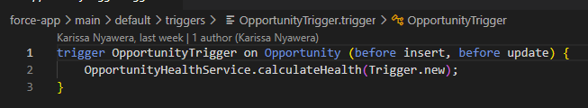
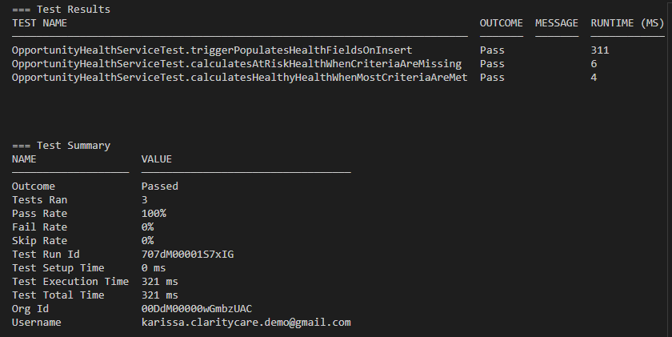
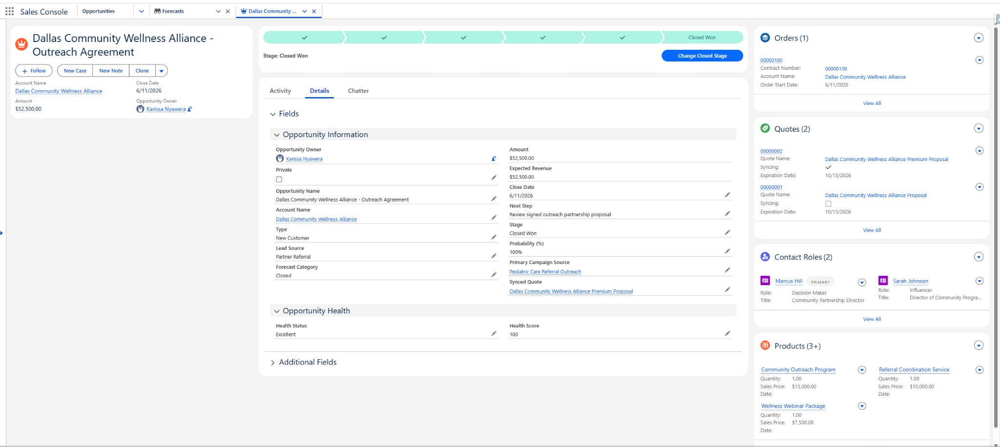

# Sales Cloud Opportunity Health Automation

## Business Problem

Sales teams often struggle to identify opportunities that are at risk due to incomplete information or missing sales process activities.

This solution automatically evaluates opportunity health based on key sales criteria and assigns a health score and status to help sales teams prioritize action.

## Overview
This project demonstrates a custom Sales Cloud opportunity health scoring solution built using Apex, Triggers, Custom Fields, and Lightning Record Pages.

## Features
- Custom Opportunity Health Score field
- Custom Opportunity Health Status field
- Apex service class for health calculations
- Trigger automation on insert and update
- Unit tests with 100% pass rate

## Health Scoring Logic

| Criteria | Points |
|-----------|---------|
| Amount populated | 25 |
| Synced Quote present | 25 |
| Next Step populated | 25 |
| Delivery/Installation Status populated | 25 |

### Status Mapping

- 90-100 = Excellent
- 70-89 = Healthy
- 40-69 = Needs Attention
- Below 40 = At Risk

## Technologies
- Salesforce Sales Cloud
- Apex
- Triggers
- Salesforce DX
- Git/GitHub
- SOQL

## Test Coverage
3 unit tests validating:
- Excellent opportunity health scenario
- At Risk opportunity health scenario
- Trigger execution and score recalculation

## Screenshots

### Project Overview

### Custom Opportunity Fields

### Apex Health Scoring Logic

### Trigger Automation

### Unit Test Results

### Opportunity Record Page

## Future Enhancements

- Add custom Lightning component for health visualization
- Add scheduled recalculation job
- Add email notification for At Risk opportunities
- Add custom report and dashboard
